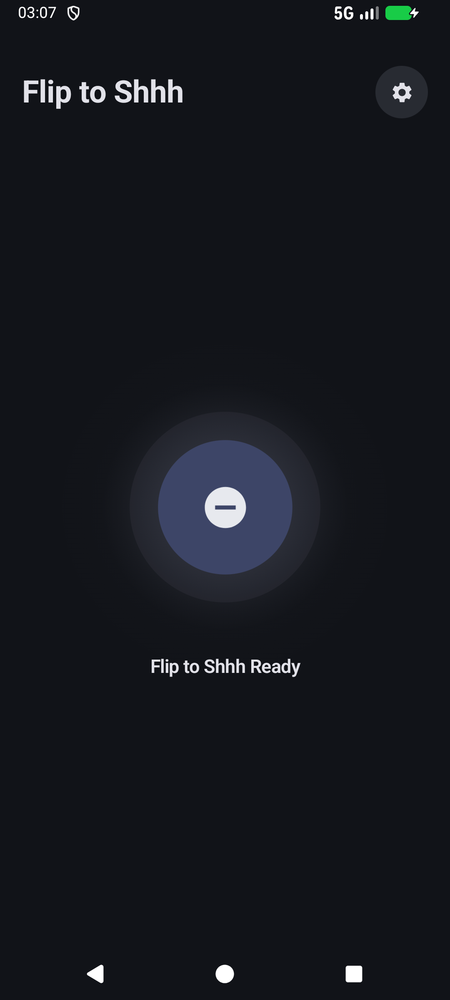
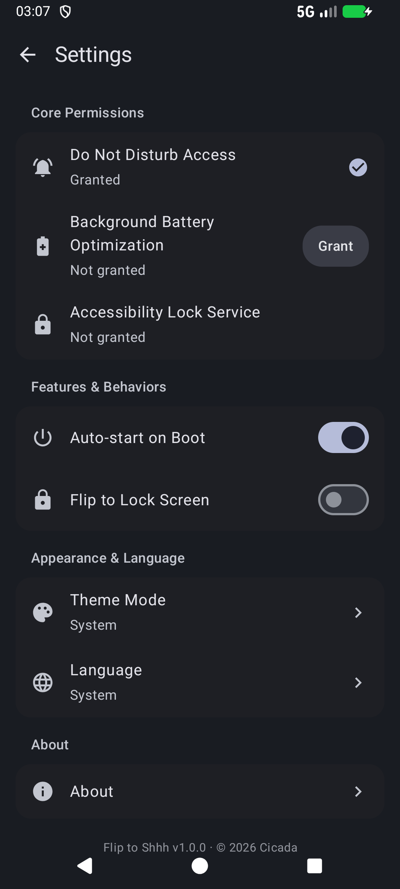
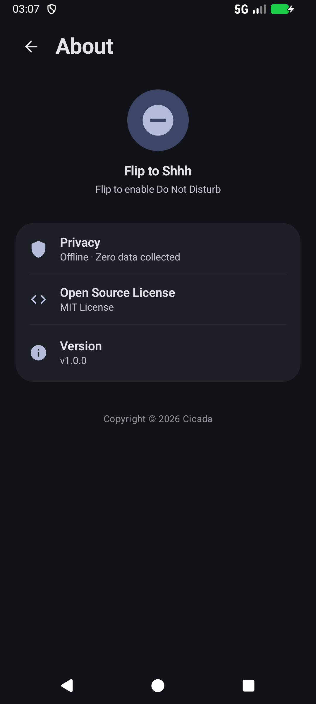

<div align="center">

# flip2shhh

**Flip to Shhh** · flip it over, tune the world out



An open-source Android utility: place your phone face down on a desk for two seconds and Do Not Disturb turns on by itself. Pick it up or flip it back, and everything is restored. Optionally locks the screen as it flips.

[简体中文](README_zh-CN.md) · English · [繁體中文](README_zh-TW.md)

</div>

---

It does one thing and only one thing: use the sensors to figure out whether the phone has been flipped face down onto a table, then press the DND switch for you.

## How it works

### Flip detection

A phone lying flat reads roughly (0, 0, −9.8) from the gravity sensor; face down, the Z axis goes negative. Entering the "flipped" state requires all of:

- Z ≤ −9.0 m/s² (face down, tolerating ~23° of tilt for camera bumps and cases)
- Horizontal magnitude √(X²+Y²) ≤ 2.5 m/s² (flat within ~15°)
- A 2-second stillness window after the trigger, during which any significant pose change resets the timer

Picking the phone up uses asymmetric thresholds (Z > −7.5 or horizontal > 3.5), so nudging it on the desk doesn't exit by accident.

**Hand-tremor filter.** On devices without an optical proximity sensor (virtual proximity implementations), holding the phone face down mid-air can alias 8–12 Hz physiological tremor into "stillness" and false-trigger. During the countdown the motion sensors automatically oversample at ~50 Hz, and any tremor above threshold (gyroscope > 0.05 rad/s or frame-to-frame acceleration > 0.07 m/s²) resets the timer. Low-power sampling resumes afterwards.

**Proximity discrimination.** On devices with a real optical proximity sensor, face-down requires the sensor to read NEAR; virtual-proximity devices rely entirely on the stillness filter above.

### The DND state machine

Once a flip is confirmed the app turns on Do Not Disturb through the system API (priority mode). It only claims ownership when it activates DND from "off": flipping back restores only the DND it started. If DND was already on, from a system sleep schedule or a manual toggle, the restore leaves it alone. If the system kills and restarts the service process, it checks the current DND state before deciding whether to continue.

### Flip-to-lock (optional)

An accessibility service calls the system's `GLOBAL_ACTION_LOCK_SCREEN`, turning the screen off as the phone flips. Fingerprint and face unlock keep working; the service declares `canRetrieveWindowContent="false"` and reads nothing from the screen.

### The settings page

A standalone Material 3 page: permission states are visible at a glance (granted ✓ / not granted + a Grant button), language and theme are single-selection bottom sheets, and every color comes from dynamic theming that follows the system. The page is fully immersive, with content drawing behind the navigation bar.

## Two branches

One foundation, two branches:

- **main** (v1.x): everything described on this page.
- **easter-egg** (v2.1.5): the same foundation plus a terminal player easter egg, seven taps on the version number from the About page. It ships an embedded song and lyrics behind a Linux-terminal-style interface. The code explains where it comes from better than this page could.

Both branches share one signature and the same package name, so installing one over the other requires an uninstall first.

## Download

Grab an APK from [Releases](https://github.com/wg2038/flip2shhh/releases). Requires Android 13+.

## Build

```bash
git clone https://github.com/wg2038/flip2shhh.git
cd flip2shhh
./gradlew assembleDebug
```

Output lands in `app/build/outputs/apk/debug/`. Needs Android SDK 34.

Pushing a `v*` tag (for example `v1.0.0`) triggers a signed release build that publishes to Releases automatically.

## Privacy

No internet permission, no analytics SDK, nothing collected. Sensor readings stay in local memory for pose detection only, never written to disk, never uploaded.

## License

[MIT](LICENSE)
