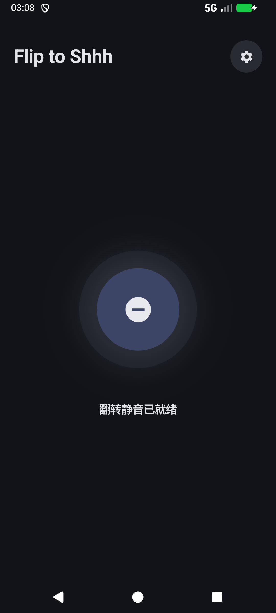
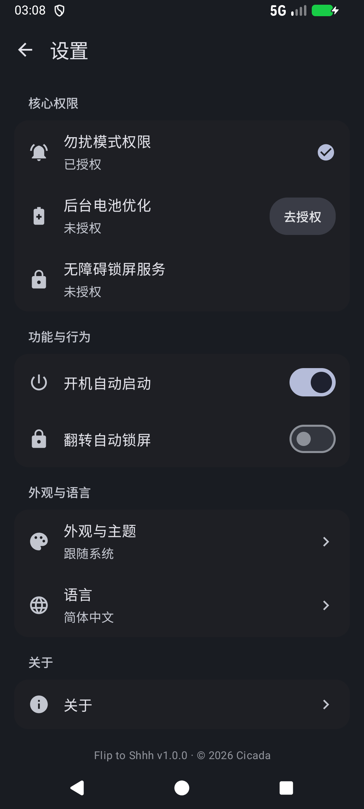
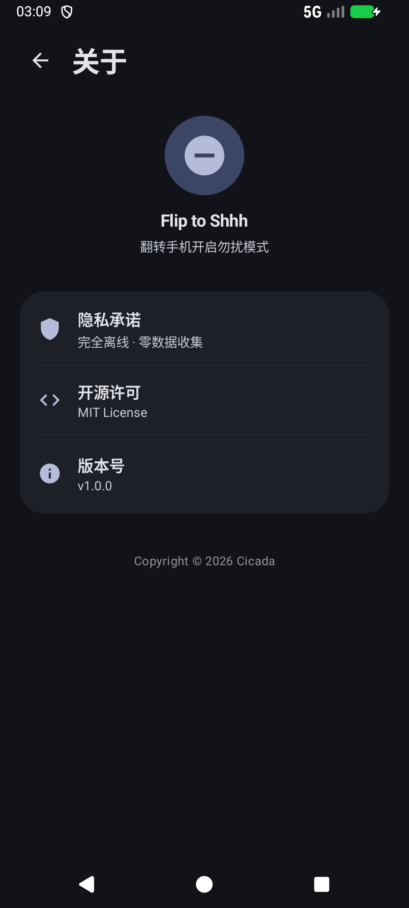

<div align="center">

# flip2shhh

**Flip to Shhh** · 翻过去，安静下来



一个开源的 Android 小工具：手机屏幕朝下放平两秒，自动开启勿扰；拿起来或翻回正面，自动恢复。可选在翻面时顺手锁屏。

简体中文 · [English](README.md) · [繁體中文](README_zh-TW.md)

</div>

---

它做一件事，并且只做一件事：用传感器判断手机是不是被翻过去扣在桌上了，然后替你按下勿扰开关。

## 它是怎么工作的

### 翻面检测

手机平放时，重力传感器大约读出 (0, 0, −9.8)。屏幕朝下扣在桌上，Z 轴分量为负。判定进入"翻面"需要同时满足：

- Z ≤ −9.0 m/s²（扣放，容忍约 23° 倾斜，兼容相机凸起和手机壳）
- 水平分量 √(X²+Y²) ≤ 2.5 m/s²（约 15° 内算平）
- 触发后进入 2 秒静止窗口，期间任何大的姿态变化都会重置计时

拿起或翻回正面的判定用了不对称阈值（Z > −7.5 或水平分量 > 3.5），在桌面上小幅挪动手机不会误退出。

**手抖滤波。** 没有光学接近传感器的设备（虚拟接近方案）上，手持悬空、屏幕朝下时，8–12 Hz 的生理性手抖可能被传感器混叠成"静止"而误触发。因此倒计时期间运动传感器自动过采样到约 50 Hz，手抖超过阈值（陀螺仪 > 0.05 rad/s 或帧间加速度 > 0.07 m/s²）就重置计时。倒计时结束后恢复低功耗采样。

**接近传感器判别。** 有真实光学接近传感器的设备，翻面时屏幕贴桌必须读到 NEAR 才触发；虚拟接近方案则完全依赖上述静止滤波。

### 勿扰状态机

翻面确认后应用调用系统接口开启勿扰（优先勿扰模式）。它只在自己从"勿扰关闭"激活时记下所有权：翻回正面时只恢复自己开启的勿扰。如果勿扰本来就开着，比如系统睡眠排程或你手动开的，翻面恢复时不会去动它。服务进程被系统回收后重启，会核对当前勿扰状态再决定是否延续。

### 翻面锁屏（可选）

通过无障碍服务调用系统的 `GLOBAL_ACTION_LOCK_SCREEN`，翻面时顺手熄屏锁定。不破坏指纹和面部解锁，亮起即刷。无障碍服务声明了 `canRetrieveWindowContent="false"`，不读取任何屏幕内容。

### 设置页

Material 3 的独立设置页：权限状态直接可见（已授权 ✓ / 未授权 + 去授权），语言和主题通过底部选择器单选，全部颜色来自动态取色，跟随系统深浅色。设置页完全沉浸，内容延伸到导航条后面。

## 两个版本

同一个底座，两个独立形态：

- **日常标准版（`main` 分支，v1.x）**：推荐主力日常使用。纯净、坚固、极致省电，持续维护并集成了底层硬件与系统兼容性修复（含三星物理光感适配与防抖抗误触调优）。
- **纪念典藏版（`easter-egg` 分支，v2.1.5）**：永久留档封存的特殊纪念特刊。保持最初始的代码与提交历史，内置专属终端音乐播放器彩蛋（在关于页连击版本号 7 次触发）。

两个版本使用同一个签名，包名相同，装了一个再装另一个需要先卸载。

## 下载

从 [Releases](https://github.com/wg2038/flip2shhh/releases) 下载 APK，安装即可。系统要求 Android 13+。

## 构建

```bash
git clone https://github.com/wg2038/flip2shhh.git
cd flip2shhh
./gradlew assembleDebug
```

产物在 `app/build/outputs/apk/debug/`。需要 Android SDK 34。

推送 `v*` 格式的标签（如 `v1.0.0`）会触发自动构建并发布 Release。

## 隐私

无网络权限，无分析 SDK，无数据收集。传感器读数只在本机内存里用于姿态判断，不落盘、不上传。

## 许可

[MIT](LICENSE)
