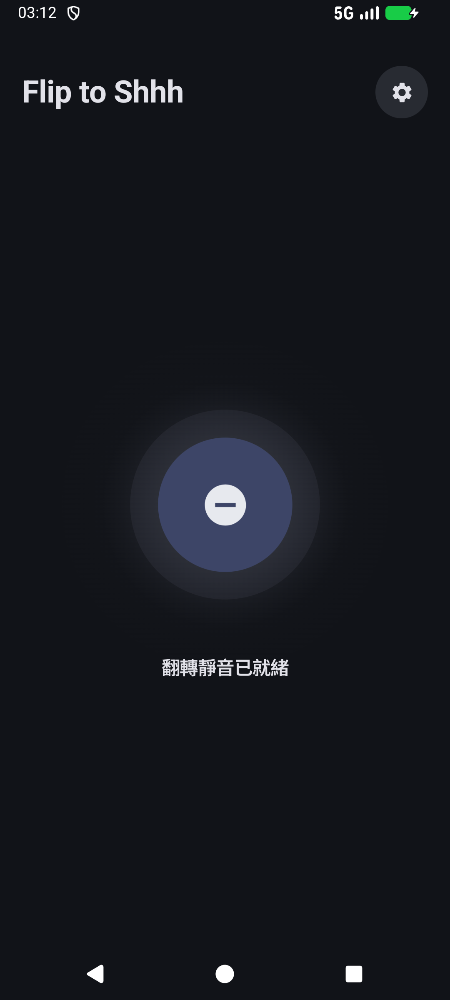
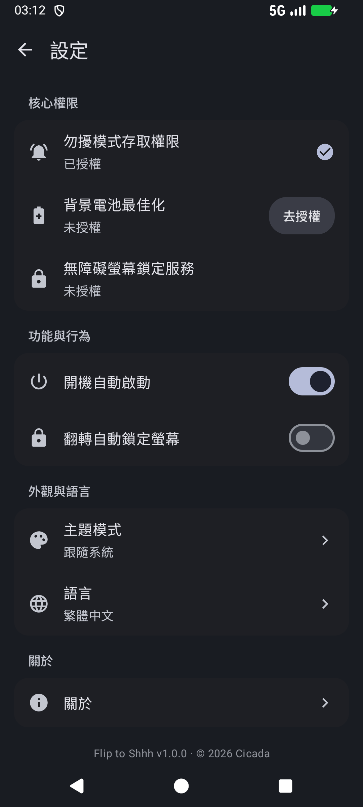
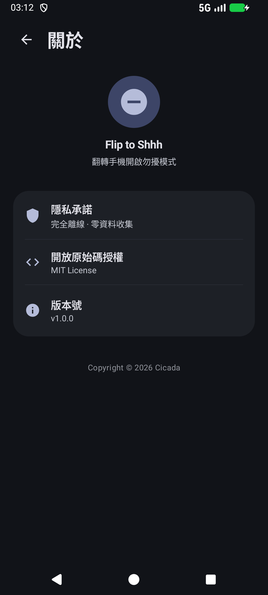

<div align="center">

# flip2shhh

**Flip to Shhh** · 翻過去，安靜下來



一個開源的 Android 小工具：手機螢幕朝下放平兩秒，自動開啟勿擾；拿起來或翻回正面，自動恢復。可選在翻面時順手鎖屏。

[简体中文](README_zh-CN.md) · [English](README.md) · 繁體中文

</div>

---

它做一件事，而且只做一件事：用感測器判斷手機是不是被翻過去扣在桌上了，然後替你按下勿擾開關。

## 它是怎麼運作的

### 翻面偵測

手機平放時，重力感測器大約讀出 (0, 0, −9.8)。螢幕朝下扣在桌上，Z 軸分量為負。判定進入「翻面」需要同時滿足：

- Z ≤ −9.0 m/s²（扣放，容忍約 23° 傾斜，兼容相機凸起和手機殼）
- 水平分量 √(X²+Y²) ≤ 2.5 m/s²（約 15° 內算平）
- 觸發後進入 2 秒靜止窗口，期間任何大的姿態變化都會重置計時

拿起或翻回正面的判定用了不對稱閾值（Z > −7.5 或水平分量 > 3.5），在桌面上小幅挪動手機不會誤退出。

**手抖濾波。** 沒有光學接近感測器的裝置（虛擬接近方案）上，手持懸空、螢幕朝下時，8–12 Hz 的生理性手抖可能被感測器混疊成「靜止」而誤觸發。因此倒數期間運動感測器自動過取樣到約 50 Hz，手抖超過閾值（陀螺儀 > 0.05 rad/s 或幀間加速度 > 0.07 m/s²）就重置計時。倒數結束後恢復低功耗取樣。

**接近感測器判別。** 有真實光學接近感測器的裝置，翻面時螢幕貼桌必須讀到 NEAR 才觸發；虛擬接近方案則完全依賴上述靜止濾波。

### 勿擾狀態機

翻面確認後應用呼叫系統介面開啟勿擾（優先勿擾模式）。它只在自己從「勿擾關閉」啟用時記下所有權：翻回正面時只恢復自己開啟的勿擾。如果勿擾本來就開著，比如系統睡眠排程或你手動開的，翻面恢復時不會去動它。服務程序被系統回收後重啟，會核對當前勿擾狀態再決定是否延續。

### 翻面鎖屏（可選）

透過無障礙服務呼叫系統的 `GLOBAL_ACTION_LOCK_SCREEN`，翻面時順手熄屏鎖定。不破壞指紋和臉部解鎖，亮起即刷。無障礙服務宣告了 `canRetrieveWindowContent="false"`，不讀取任何螢幕內容。

### 設定頁

Material 3 的獨立設定頁：權限狀態直接可見（已授權 ✓ / 未授權 + 去授權），語言和主題透過底部選擇器單選，全部顏色來自動態取色，跟隨系統深淺色。設定頁完全沉浸，內容延伸到導覽列後面。

## 兩個版本

同一個底座，兩個分支：

- **main 分支**（v1.x）：本頁描述的全部功能。
- **easter-egg 分支**（v2.1.5）：同樣的底座，多一個終端播放器彩蛋，在關於頁連點版本號七次。它內嵌了一首歌和歌詞，用一個模仿 Linux 終端的介面播放。關於這個彩蛋的來歷，程式碼裡寫得比這裡清楚。

兩個分支使用同一個簽名，套件名稱相同，裝了一個再裝另一個需要先解除安裝。

## 下載

從 [Releases](https://github.com/wg2038/flip2shhh/releases) 下載 APK，安裝即可。系統要求 Android 13+。

## 建置

```bash
git clone https://github.com/wg2038/flip2shhh.git
cd flip2shhh
./gradlew assembleDebug
```

產物在 `app/build/outputs/apk/debug/`。需要 Android SDK 34。

推送 `v*` 格式的標籤（如 `v1.0.0`）會觸發自動建置並發布 Release。

## 隱私

無網路權限，無分析 SDK，無資料收集。感測器讀數只在本機記憶體裡用於姿態判斷，不落盤、不上傳。

## 授權

[MIT](LICENSE)
