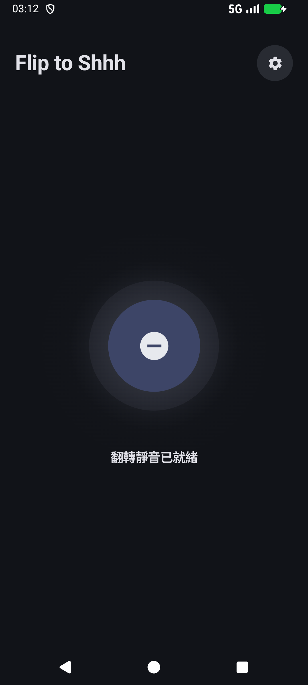
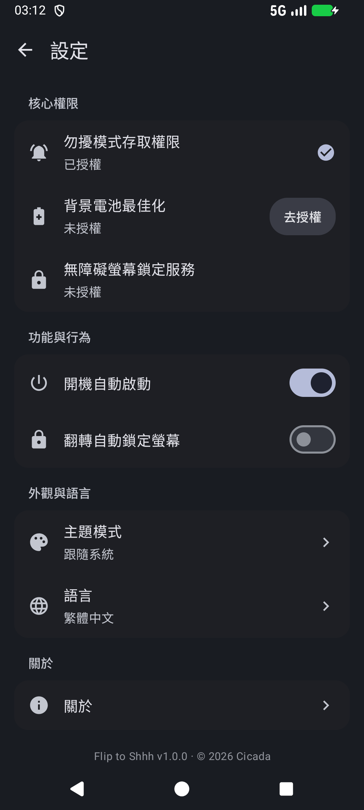
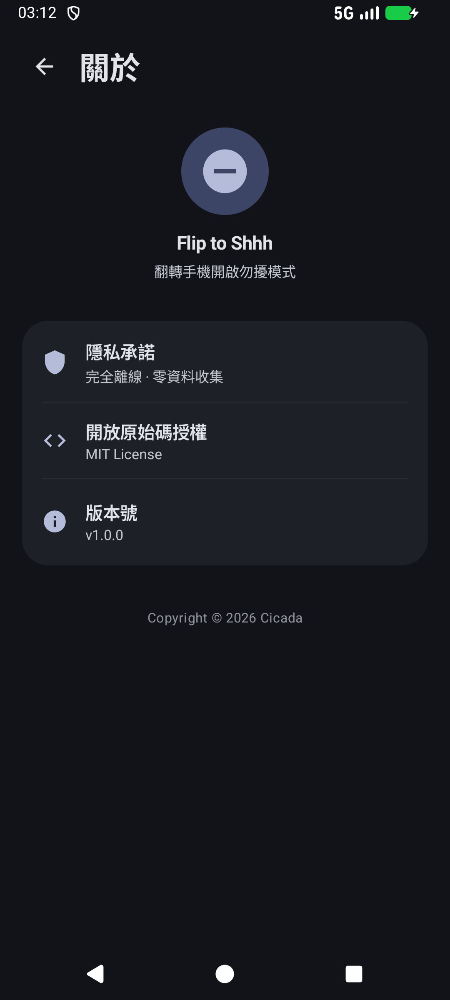

<div align="center">

# flip2shhh

**Flip to Shhh** · 翻過去，安靜下來



一個開源的 Android 小工具：手機螢幕朝下放平兩秒，自動開啟勿擾；拿起來或翻回正面，恢復先前的狀態。可選在翻面時順手鎖屏。

[简体中文](README_zh-CN.md) · [English](README.md) · 繁體中文

</div>

---

它只做一件事：用感測器判斷手機是否正面朝下平放在桌面上，然後替你操作系統的勿擾開關。沒有網路權限，沒有分析統計，不需要帳號。

## 實作原理

### 翻面偵測

- **重力方向。** 手機平放時重力感測器約為 `(0, 0, −9.8) m/s²`；螢幕朝下時 Z 軸明顯為負。進入判定要求 `Z ≤ −9.0` 且水平分量 `√(X²+Y²) ≤ 2.5`，為相機凸起和手機殼留出約 23° / 15° 的容差。
- **兩秒靜止。** 候選姿態必須連續保持 2.0 秒。倒數期間運動感測器提升到約 50 Hz 過取樣，陀螺儀大於 0.05 rad/s 或幀間加速度大於 0.07 m/s² 就重置計時，避免手機拿在手中懸空朝下時誤觸發。
- **接近感測器融合與回退。** 真實光學接近感測器有讀數時，用最新的 NEAR 讀數確認螢幕貼著表面；如果感測器從未上報，或最近一次讀數已超過 5 秒，則回退到靜止判定，不會像舊版那樣被無讀數感測器永久鎖死。
- **不對稱退出。** 拿起或傾斜使用更寬鬆的閾值（`Z > −7.5` 或水平分量 > 3.5），在桌面上小幅挪動不會誤關勿擾。
- **按需取樣。** 陀螺儀和高速取樣只在倒數期間開啟，閒置時使用低功耗 UI 取樣率；短暫持有 `PARTIAL_WAKE_LOCK`，確保熄屏時計時器和感測器回呼繼續運作。

### 勿擾狀態機

確認翻面後，應用呼叫 `NotificationManager.setInterruptionFilter(INTERRUPTION_FILTER_PRIORITY)` 開啟勿擾，並記錄這次勿擾是不是自己開啟的：

- 翻面前勿擾是關閉的：翻回來時恢復 `INTERRUPTION_FILTER_ALL`。
- 翻面前勿擾已經開著（系統睡眠排程、手動開關或其他應用）：服務不會擅自關閉它。
- 透過 `ACTION_INTERRUPTION_FILTER_CHANGED` 監聽外部變化；使用者手動關掉勿擾時同步清理內部狀態。
- 狀態會持久化保存，服務程序重啟後先核對目前系統勿擾狀態再決定是否延續。通知策略權限被撤銷時，服務立即停止。

### 翻面鎖屏（可選）

透過無障礙服務呼叫系統的 `GLOBAL_ACTION_LOCK_SCREEN`，翻面時順手熄屏鎖定。服務宣告了 `canRetrieveWindowContent="false"`，不讀取任何螢幕內容，指紋和臉部解鎖不受影響。

### 服務與介面

偵測邏輯執行在 `specialUse` 前景服務中，常駐通知使用最低重要性；開啟開機自啟後會隨系統啟動，並返回 `START_STICKY`。Compose 介面包含引導頁、權限狀態、開機自啟與自動鎖屏開關、語言選擇（简体中文 / 繁體中文 / English）、主題切換和 Material 3 動態取色。

## 兩個版本（最終版）

- **標準版 —— `main` 分支，v1.0.4**：上述日常使用版本。
- **紀念版 —— `easter-egg` 分支，v2.1.5.3**：相同底座，外加一個終端機音樂播放器彩蛋；在關於頁連續點擊版本號七次，會開啟一個 Linux 風格終端機，播放內嵌歌曲並顯示同步歌詞。

兩個版本使用相同的套件名稱 `shhh.cicada.flip` 和同一簽名，安裝其中一個後再裝另一個需要先解除安裝。

## 下載

從 [Releases](https://github.com/wg2038/flip2shhh/releases) 下載 APK。系統要求 Android 13 及以上。

## 建置

```bash
git clone https://github.com/wg2038/flip2shhh.git
cd flip2shhh
./gradlew assembleDebug
```

產物在 `app/build/outputs/apk/debug/`。需要 Android SDK 34。

## 隱私

應用不申請網路權限，不包含分析或追蹤 SDK。感測器讀數只在記憶體中用於姿態判斷，不落盤、不上傳。

## 最終更新

**2026-10-18** · 1.0.4 是標準版的最終版本。本次最終修改由 DeepSeek v4.1 Flash 模型完成。如無意外，後續不再更新。

## 授權

[MIT](LICENSE)
